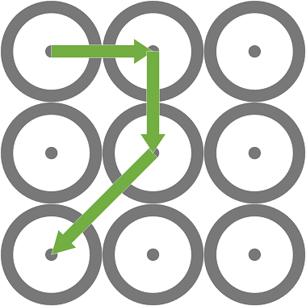
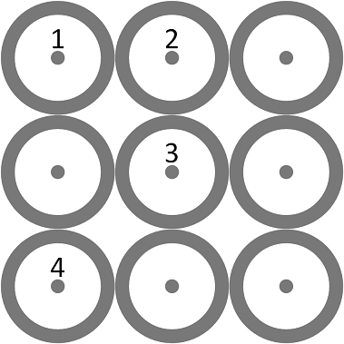
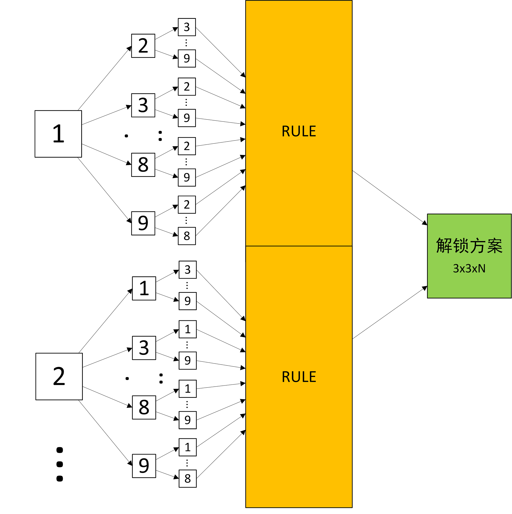

# 九宫格手机解锁问题


### 问题背景
手机的九宫格解锁大家肯定都不陌生，是生活中常见的一种密码解锁方案，其由九个节点构成，密码为从其中一点出发经过至少另外三个点（总共至少四个点）后形成的轨迹。而一个九宫格能组成多少种不同的轨迹，是一个很难从数学角度进行建模的问题。在出发解决这个问题之前，让我们先确认几个定义：我们将前往节点的动作称之为步，从选取起点开始为第一步，最少为四步。下一步可选的符合规则的所有节点称为下一步的可选方向。从数学分析来看，难点在于第n+1步的可选方向受之前{1, 2, 3, ... ... , n}步的影响，并且随着n增大，需要考虑的情况指数迅速增多。因此，我们使用数学归纳法整理出**取点原则**后使用计算机程序对全部解锁方案进行遍历，找出所有符合条件的方案。

### 问题分析
首先我们整理出取点原则有如下两条：

* 目标节点为空节点
* 一个步没有跨越任何空节点

为了方便使用编程方法表示这两条原则，我们需要把九宫格的解锁路径用一种方便储存的数据结构来表达。这里我们将九宫格用一个3x3的二维零矩阵表示，并且为走过的节点对应的矩阵值赋以当前步数的值。比如路线如下：



将步数赋值给相应的矩阵位置，则有：



矩阵表示如下：
$$\begin{pmatrix}
 1&  2& 0\\
 0&  3& 0\\
 4&  0& 0
\end{pmatrix}$$

通过以上变换，我们可以将取点原则改为：

* 目标点为0
* 中间点的值不为0（如果有中间值）

最后，通过如下顺序对所有解锁方案进行遍历，经过取点原则筛选后获得所有可行的解锁方案：


最后汇总的解锁方案，为一个3\*3\*m的三维结构，像一个空中停车场一样，将每一个解决方案叠上去。比如当最大步数为4时，一共有1624种可行的解决方案，因此最后获得的是一个3\*3\*1624的三维矩阵。

### 编程方案
在解释编程方案前，我们需要弄懂MatLab中访问矩阵值的两种方法——**下标法（Subscipt）** 和 **线性索引法（Index）**。在上述矩阵
$$\begin{pmatrix}
 1&  2& 0\\
 0&  3& 0\\
 4&  0& 0
\end{pmatrix}$$

中，如果我们需要访问获得矩阵值4的位置，有两种方法，如下所示：
```matlab
>> mat = [1,2,0;0,3,0;4,0,0]

mat =

     1     2     0
     0     3     0
     4     0     0

>> mat(3,1)

ans =

     4

>> mat(3)

ans =

     4
```

我们可以发现，使用两种方法索引到的值是不一样的。那么代码中`mat(3)`是一种怎样的索引原理呢？如果将矩阵中的所有值的序号列出来，下标法的列法如下：
$$\begin{pmatrix}
 (1,1)&  (1,2)& (1,3)\\
 (2,1)&  (2,2)& (2,3)\\
 (3,1)&  (3,2)& (3,3)
\end{pmatrix}$$

而线性索引法的列法如下：
$$\begin{pmatrix}
 1&  4& 7\\
 2&  5& 8\\
 3&  6& 9
\end{pmatrix}$$

这两种索引方式可以通过[ind2sub()][1]和[sub2ind()][2]两个函数相互转换。

熟悉MatLab的矩阵结构后，我们可以通过线性索引法将解决方案的矩阵转换为n维的行向量，矩阵的每一项对应每一步取点的线性索引值，n为最大步数。比如我们可以将矩阵
$$\begin{pmatrix}
 1&  2& 0\\
 0&  3& 0\\
 4&  0& 0
\end{pmatrix}$$

转换为4维行向量：
$$\begin{pmatrix}
 1&  4& 5& 3
\end{pmatrix}$$

因此我们可以将最后的解决方案用一个n\*m的二维矩阵代替。原来的3\*3\*1624的三维矩阵就变成了4\*1624的二维矩阵。

### 调试过程
#### 运行时间及搜索效率测试
| 步数 | 时间(s) | 方案数量 | 循环次数 | 查找效率 |
|------|---------|----------|----------|----------|
| 4    | 0.449   | 1640     | 3024     | 6735     |
| 5    | 2.640   | 7152     | 15120    | 5727     |
| 6    | 12.783  | 26016    | 60480    | 4731     |
| 7    | 48.245  | 72912    | 181440   | 3761     |
| 8    | 141.469 | 140704   | 362880   | 2565     |
| 9    | 189.319 | 140704   | 362880   | 1917     |


在测试运行时间时发现最大步数为9时，相比最大步数为8的时候，最后的方案数量相等。第一反应是程序写的有问题，然而又没有报错，查看了一下可能出问题的几个地方发现没有问题，于是开始思考。然后很快的意识到，在第8点的位置时，取点方向**必定有且只有一个**，因此解决方案的数量没有变化；而且相比多了一层嵌套，因此运行时间上也相对多花了一些。

### 结果演示


[1]: https://ww2.mathworks.cn/help/matlab/ref/ind2sub.html
[2]: https://ww2.mathworks.cn/help/matlab/ref/sub2ind.html
